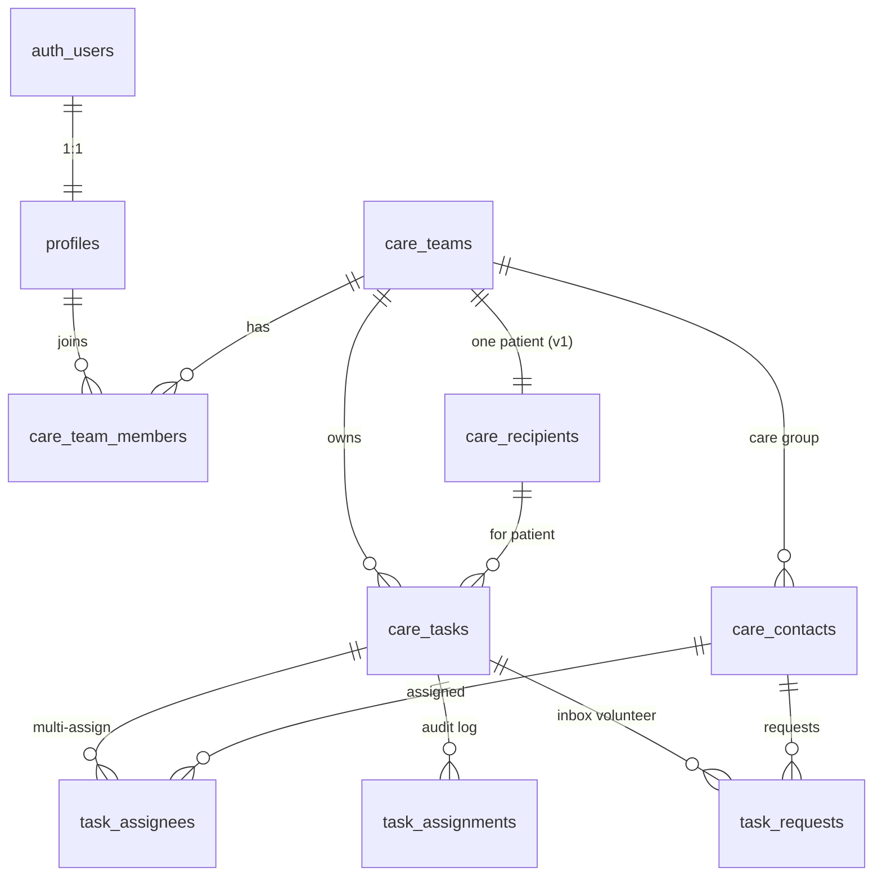

# Supabase Backend Plan — CaregiverApp

This document defines the Postgres schema, security model, and phased rollout for replacing Milestone 1 mocks with Supabase.

**Prerequisites:** Domain models in `CaregiverApp/Domain/Models/` are aligned with this plan (completed). Remote Supabase project has **9 tables with RLS enabled** (migrations applied 2026-06-04).

---

## 1. Product model



| Concept | Swift model | Postgres table | Notes |
|---------|-------------|----------------|-------|
| Signed-in user | `UserProfile` | `profiles` | `id` = `auth.users.id` |
| Household | `CareTeam` | `care_teams` | Scopes all care data |
| Team membership | — | `care_team_members` | Links users + roles to a team |
| Patient | `CareRecipient` | `care_recipients` | One per team in v1 |
| Care group member | `CareContact` | `care_contacts` | May link to `profiles` via `linked_user_id` |
| Task | `CareTask` | `care_tasks` + `task_assignees` | Multi-assignee junction table |
| Assignment audit | `TaskAssignment` | `task_assignments` | Written on assign/reassign |
| Inbox volunteer | `TaskRequest` | `task_requests` | Pending → accept adds assignee |
| Recurrence | `TaskRecurrence` | columns on `care_tasks` | Expand to series table in v2 |

---

## 2. Auth & tenancy

### Sign-in (Milestone 2)

- **Primary caregivers:** Sign in with Apple or magic link (email OTP).
- **Helpers:** Invite link → sign up → `care_contacts.linked_user_id` set to their `profiles.id`.
- **Session:** Supabase Swift SDK; store session in Keychain.

### Tenancy rule

Every row is scoped by `care_team_id`. RLS checks membership via `care_team_members` where `user_id = auth.uid()`.

### Roles

| Role | Capabilities |
|------|----------------|
| `primary_caregiver` | Full CRUD on team, tasks, contacts, patient |
| `helper` | Read team tasks; update tasks assigned to them; create task requests |

Store role in `care_team_members.role` (not `user_metadata` — user-editable and unsafe for RLS).

---

## 3. SQL migration (initial)

Apply as `supabase/migrations/20260604000000_initial_schema.sql` after `supabase init`.

```sql
-- Extensions
create extension if not exists "pgcrypto";

-- Enums
create type public.task_status as enum ('unassigned', 'assigned', 'completed');
create type public.task_request_status as enum ('pending', 'accepted', 'declined');
create type public.caregiver_role as enum ('primary_caregiver', 'helper');
create type public.recurrence_frequency as enum ('none', 'daily', 'weekly', 'monthly', 'yearly', 'custom');
create type public.recurrence_unit as enum ('days', 'weeks', 'months', 'years');

-- Profiles (extends auth.users)
create table public.profiles (
  id uuid primary key references auth.users (id) on delete cascade,
  name text not null,
  phone text not null default '',
  email text not null default '',
  avatar_url text,
  created_at timestamptz not null default now(),
  updated_at timestamptz not null default now()
);

-- Care teams
create table public.care_teams (
  id uuid primary key default gen_random_uuid(),
  name text not null,
  primary_caregiver_id uuid not null references public.profiles (id),
  created_at timestamptz not null default now()
);

-- Team membership (for RLS)
create table public.care_team_members (
  id uuid primary key default gen_random_uuid(),
  care_team_id uuid not null references public.care_teams (id) on delete cascade,
  user_id uuid not null references public.profiles (id) on delete cascade,
  role public.caregiver_role not null default 'helper',
  created_at timestamptz not null default now(),
  unique (care_team_id, user_id)
);

-- Patient
create table public.care_recipients (
  id uuid primary key default gen_random_uuid(),
  care_team_id uuid not null references public.care_teams (id) on delete cascade unique,
  name text not null,
  date_of_birth date not null,
  gender text not null default '',
  blood_type text not null default '',
  allergies text not null default '',
  favorite_food text not null default '',
  health_notes text not null default '',
  created_at timestamptz not null default now(),
  updated_at timestamptz not null default now()
);

-- Care group contacts
create table public.care_contacts (
  id uuid primary key default gen_random_uuid(),
  care_team_id uuid not null references public.care_teams (id) on delete cascade,
  name text not null,
  relationship text not null default 'Other',
  phone text not null default '',
  email text not null default '',
  avatar_symbol_name text,
  system_contact_identifier text,
  linked_user_id uuid references public.profiles (id),
  created_at timestamptz not null default now(),
  updated_at timestamptz not null default now()
);

create unique index care_contacts_system_contact_idx
  on public.care_contacts (care_team_id, system_contact_identifier)
  where system_contact_identifier is not null;

-- Tasks
create table public.care_tasks (
  id uuid primary key default gen_random_uuid(),
  care_team_id uuid not null references public.care_teams (id) on delete cascade,
  patient_id uuid not null references public.care_recipients (id) on delete cascade,
  title text not null,
  scheduled_at timestamptz not null,
  duration_minutes int not null check (duration_minutes > 0),
  instructions text not null default '',
  status public.task_status not null default 'unassigned',
  recurrence_frequency public.recurrence_frequency not null default 'none',
  recurrence_interval int not null default 1 check (recurrence_interval >= 1),
  recurrence_unit public.recurrence_unit,
  created_by_id uuid not null references public.profiles (id),
  created_at timestamptz not null default now(),
  updated_at timestamptz not null default now()
);

create index care_tasks_team_schedule_idx on public.care_tasks (care_team_id, scheduled_at);

-- Multi-assignee junction
create table public.task_assignees (
  task_id uuid not null references public.care_tasks (id) on delete cascade,
  assignee_id uuid not null references public.care_contacts (id) on delete cascade,
  assigned_at timestamptz not null default now(),
  primary key (task_id, assignee_id)
);

-- Assignment audit trail
create table public.task_assignments (
  id uuid primary key default gen_random_uuid(),
  task_id uuid not null references public.care_tasks (id) on delete cascade,
  assignee_id uuid not null references public.care_contacts (id) on delete cascade,
  assigned_by_id uuid not null references public.profiles (id),
  assigned_at timestamptz not null default now()
);

-- Inbox: volunteer requests for unassigned tasks
create table public.task_requests (
  id uuid primary key default gen_random_uuid(),
  task_id uuid not null references public.care_tasks (id) on delete cascade,
  requester_id uuid not null references public.care_contacts (id) on delete cascade,
  status public.task_request_status not null default 'pending',
  created_at timestamptz not null default now(),
  unique (task_id, requester_id)
);

-- Auto-create profile on signup
create or replace function public.handle_new_user()
returns trigger
language plpgsql
security definer
set search_path = public
as $$
begin
  insert into public.profiles (id, name, email)
  values (
    new.id,
    coalesce(new.raw_user_meta_data ->> 'full_name', split_part(new.email, '@', 1)),
    coalesce(new.email, '')
  );
  return new;
end;
$$;

create trigger on_auth_user_created
  after insert on auth.users
  for each row execute function public.handle_new_user();

-- updated_at helper
create or replace function public.set_updated_at()
returns trigger language plpgsql as $$
begin
  new.updated_at = now();
  return new;
end;
$$;

create trigger care_recipients_updated_at before update on public.care_recipients
  for each row execute function public.set_updated_at();
create trigger care_contacts_updated_at before update on public.care_contacts
  for each row execute function public.set_updated_at();
create trigger care_tasks_updated_at before update on public.care_tasks
  for each row execute function public.set_updated_at();
create trigger profiles_updated_at before update on public.profiles
  for each row execute function public.set_updated_at();
```

---

## 4. Row Level Security

Enable RLS on every table above. Example policies:

```sql
alter table public.profiles enable row level security;
alter table public.care_teams enable row level security;
alter table public.care_team_members enable row level security;
alter table public.care_recipients enable row level security;
alter table public.care_contacts enable row level security;
alter table public.care_tasks enable row level security;
alter table public.task_assignees enable row level security;
alter table public.task_assignments enable row level security;
alter table public.task_requests enable row level security;

-- Helper: is member of team
create or replace function public.is_team_member(team_id uuid)
returns boolean language sql stable security definer set search_path = public as $$
  select exists (
    select 1 from public.care_team_members
    where care_team_id = team_id and user_id = auth.uid()
  );
$$;

create or replace function public.is_primary_caregiver(team_id uuid)
returns boolean language sql stable security definer set search_path = public as $$
  select exists (
    select 1 from public.care_team_members
    where care_team_id = team_id
      and user_id = auth.uid()
      and role = 'primary_caregiver'
  );
$$;

-- Profiles: read/update own row only
create policy "profiles_select_own" on public.profiles
  for select using (id = auth.uid());
create policy "profiles_update_own" on public.profiles
  for update using (id = auth.uid());

-- Care teams: members can read; primary can update
create policy "teams_select_member" on public.care_teams
  for select using (public.is_team_member(id));
create policy "teams_insert_authenticated" on public.care_teams
  for insert with check (primary_caregiver_id = auth.uid());
create policy "teams_update_primary" on public.care_teams
  for update using (public.is_primary_caregiver(id));

-- Team members
create policy "members_select" on public.care_team_members
  for select using (public.is_team_member(care_team_id));
create policy "members_manage_primary" on public.care_team_members
  for all using (public.is_primary_caregiver(care_team_id));

-- Patient, contacts: team members read; primary writes
create policy "recipients_team_read" on public.care_recipients
  for select using (public.is_team_member(care_team_id));
create policy "recipients_primary_write" on public.care_recipients
  for all using (public.is_primary_caregiver(care_team_id));

create policy "contacts_team_read" on public.care_contacts
  for select using (public.is_team_member(care_team_id));
create policy "contacts_primary_write" on public.care_contacts
  for all using (public.is_primary_caregiver(care_team_id));

-- Tasks: team read; primary full write; helpers update assigned tasks
create policy "tasks_team_read" on public.care_tasks
  for select using (public.is_team_member(care_team_id));
create policy "tasks_primary_write" on public.care_tasks
  for insert with check (public.is_primary_caregiver(care_team_id));
create policy "tasks_primary_update" on public.care_tasks
  for update using (public.is_primary_caregiver(care_team_id));
create policy "tasks_primary_delete" on public.care_tasks
  for delete using (public.is_primary_caregiver(care_team_id));

-- Task assignees / assignments / requests: team read; primary manages
create policy "assignees_team_read" on public.task_assignees
  for select using (
    exists (
      select 1 from public.care_tasks t
      where t.id = task_id and public.is_team_member(t.care_team_id)
    )
  );
create policy "assignees_primary_write" on public.task_assignees
  for all using (
    exists (
      select 1 from public.care_tasks t
      where t.id = task_id and public.is_primary_caregiver(t.care_team_id)
    )
  );

-- Similar patterns for task_assignments and task_requests
create policy "requests_team_read" on public.task_requests
  for select using (
    exists (
      select 1 from public.care_tasks t
      where t.id = task_id and public.is_team_member(t.care_team_id)
    )
  );
create policy "requests_insert_helper" on public.task_requests
  for insert with check (
    exists (
      select 1 from public.care_tasks t
      where t.id = task_id and public.is_team_member(t.care_team_id)
    )
  );
create policy "requests_update_primary" on public.task_requests
  for update using (
    exists (
      select 1 from public.care_tasks t
      where t.id = task_id and public.is_primary_caregiver(t.care_team_id)
    )
  );
```

Run `get_advisors` (MCP) after applying migrations to catch missing SELECT policies on UPDATE paths.

---

## 5. Realtime & notifications

| Event | Channel | iOS action |
|-------|---------|------------|
| Task created/updated | `care_tasks:care_team_id=eq.{id}` | Refresh timeline |
| Assignee added | `task_assignees` join | Update row initials |
| Task request | `task_requests` insert | Inbox badge + push |
| Request accepted | task + assignee insert | Notify requester |

**Push (Milestone 3):** Edge Function on `task_assignees` insert → APNs via stored device tokens table (`device_tokens` — add in later migration).

---

## 6. iOS integration phases

### Phase A — Foundation (1–2 days)

1. Add [supabase-swift](https://github.com/supabase/supabase-swift) via SPM.
2. Create `Infrastructure/Supabase/SupabaseClient+Live.swift` with project URL + anon key from MCP `get_project_url` / `get_publishable_keys`.
3. Add `SessionStore` (`@Observable`) wrapping `auth.session`.
4. Sign-in screen (Apple / email OTP).

### Phase B — Repositories (2–3 days)

Replace mocks with Supabase implementations:

| Protocol | Supabase source | Notes |
|----------|-----------------|-------|
| `ContactRepository` | `care_contacts` | Filter by `care_team_id` |
| `PatientRepository` | `care_recipients` | Single row per team |
| `TaskRepository` | `care_tasks` + `task_assignees` | Join assignees on fetch; upsert junction on save |
| *(new)* `TaskRequestRepository` | `task_requests` | Inbox accept/decline |
| *(new)* `AuthRepository` | `auth` + `profiles` | Onboarding creates team |

**Wire UI (still Milestone 1 gap):**

- `TimelineView` → `TaskRepository.fetchAllTasks()` / `fetchTasks(assigneeID:)`
- `TaskSheetView` → build `CareTask` + save; map `RepeatOption` → `TaskRecurrence`
- `InboxView` → `TaskRequestRepository`

### Phase C — Realtime (1 day)

- Subscribe to `care_tasks` and `task_requests` for active `careTeamID`.
- Invalidate timeline on postgres changes.

### Phase D — Invites & helper app experience (later)

- Deep link invite → join `care_team_members` + link `care_contacts.linked_user_id`.
- “My Task” tab filters by current user's linked contact id.

---

## 7. Repository query examples

**Fetch tasks with assignees:**

```sql
select
  t.*,
  coalesce(array_agg(ta.assignee_id) filter (where ta.assignee_id is not null), '{}') as assignee_ids
from care_tasks t
left join task_assignees ta on ta.task_id = t.id
where t.care_team_id = $1
  and t.scheduled_at >= $2
  and t.scheduled_at < $3
group by t.id
order by t.scheduled_at;
```

**Save task + assignees (transaction):**

1. Upsert `care_tasks` row.
2. Delete removed rows from `task_assignees`.
3. Insert new assignees.
4. Insert `task_assignments` audit rows.
5. Set `status` derived from assignee count.

**Accept inbox request:**

1. Update `task_requests.status = 'accepted'`.
2. Insert into `task_assignees`.
3. Decline other pending requests for same task (optional product rule).

---

## 8. Seed data mapping

Local `SeedData.swift` UUIDs map 1:1 for dev/testing when using `execute_sql` inserts. For production, let Postgres generate UUIDs and return them to the client.

| Seed constant | Table |
|---------------|-------|
| `careTeamID` | `care_teams.id` |
| `primaryCaregiverID` | `profiles.id` (= auth user) |
| `patientID` | `care_recipients.id` |
| `lilyID`, `jamesID`, `annaID` | `care_contacts.id` |
| `sampleTasks` | `care_tasks` + `task_assignees` |
| `sampleTaskRequests` | `task_requests` |

---

## 9. Local development workflow

```bash
supabase init
supabase start
# Copy migration SQL into supabase/migrations/
supabase db reset
supabase gen types --local > Infrastructure/Supabase/DatabaseTypes.swift  # optional
```

Use MCP `execute_sql` for remote iteration; commit with `supabase db pull` when schema stabilizes.

---

## 10. Security checklist (before launch)

- [x] RLS enabled on all public tables
- [ ] No authorization from `user_metadata`
- [ ] `service_role` key never in iOS bundle
- [ ] Views use `security_invoker = true` if added
- [ ] Storage policies if profile avatars uploaded
- [x] Run MCP `get_advisors` type `security` (warnings only — helper function execute revoked)

---

## 11. Known app gaps to close during backend rollout

| Gap | Status | Resolution |
|-----|--------|------------|
| Timeline hardcoded data | Done | `TimelineStore` + `CareTask.timelinePresentation` |
| Task composer doesn't save | Done | `TaskRepository.saveTask` on Save |
| Settings profile hardcoded | Open | Read from `SessionStore` + `profiles` |
| `PatientRepository.savePatient` unused | Open | Add edit UI on Details tab |
| Inbox static UI | Open | `TaskRequestRepository` + accept/decline |
| iOS Supabase client | Open | Phase A — supabase-swift + auth |

---

## 12. Next actions

1. ~~Apply migration~~ — done (remote project)
2. ~~Verify~~ — 9 tables, RLS enabled
3. **Phase A** — add supabase-swift + auth shell
4. **Phase B** — implement Supabase repositories; replace mocks
5. **Inbox** — `TaskRequestRepository` for volunteer flow
